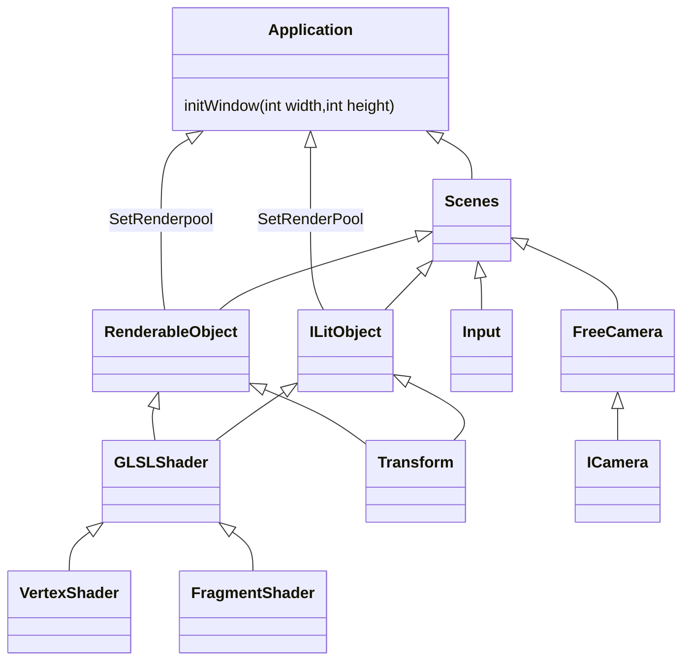
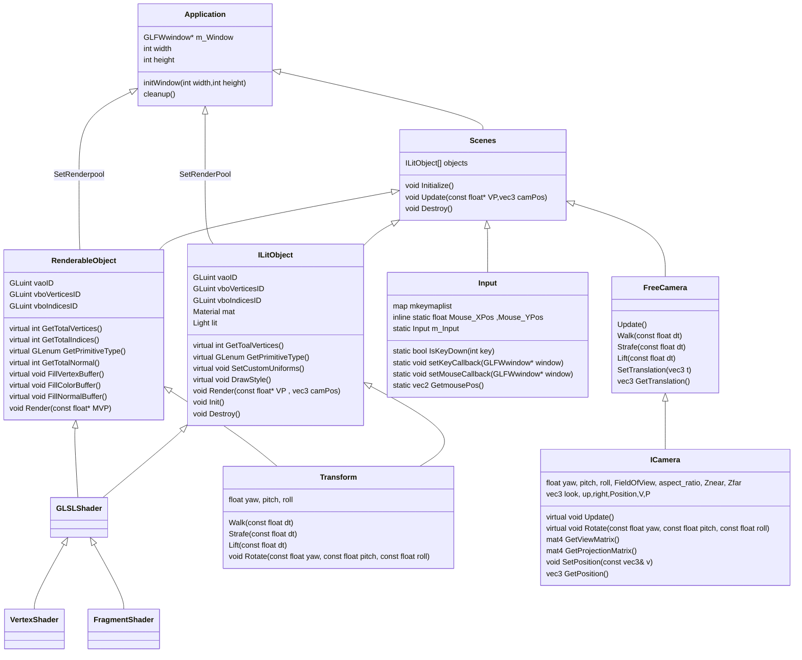

## Objectives:

To build an OpenGL-based project with glad and represent transformations lighting and movement. 

### Learning outcomes:

understanding of basic 

- Shader programs
- Transformation
- Views and local spaces
- Lighting basics

### Personal goals

To build an OpenGl project that is flexible enough to later turn into a client that can be easily extended to make high-level projects.

### The list

- [x]  Have flexible renderable objects system that can be easily instantiated in a scene.
- [ ]  have Transformations be easily applied for each of those objects consistently.
- [x]  Having an input system that is useable across all scripts
- [ ]  Material-based lighting can individually change how lighting impacts each object.
- [x]  Easy to use and replaceable system that can extend to objects easily
- [ ]  Make sure to use great object oriented patterns

## Project Life

As we are writing an application by the end of the day. I wanted to keep the program's main or source to be as concise as possible. To make sure of this i divided the Application class to do limited things. 

In the bases of using something called the SOLID principles. So the Single responsibility for the Application class it to make sure that it will redirect the programs always to the correct path. 

hence I ended up with 

```cpp
class Application {
    
    GLFWwindow* m_Window;
    void initWindow(int width,int height);
    void cleanup();
    static void framebuffer_size_callback(GLFWwindow* window, int width, int height);
    std::map<std::string,std::unique_ptr<IRenderableObject>> *RenderPool = new std::map<std::string, std::unique_ptr<IRenderableObject>>();
    
public:
    const char* appName = "Application Name";
    int width;
    int height;
    inline static CFreeCamera MainCamera;
    
    Application(const char* AppName, int Width, int Height);
    
    void SetRenderPool(std::map<std::string,std::unique_ptr<IRenderableObject>> &renderPool);
    
    void init();
    void run();
    
    ClockScene* clockScene;
};
```

this class is responsible for making sure that we have always got the correct start point and also helps create the correct time for initialising and updating the objects 

The current problem with the application class is that is also currently manages the camera system and movement. This is not ideal but as my main goal is to get things up and running this class is great as it also can on the correct time throw errors and make it so that we don’t have too much code cluttering up the main of this itself. 

This also forces me to make more independent classes so i can easily add or remove features. 

Currently, it was also meant to handle deltatime. This class is still being worked on so it’s not there yet. 

### Shaders for all.

The most important thing in any graphics program in the end is the shader class. This class will be necessary to create links and add shaders finally to each object. Without these there is nothing to render in the first place. 

This class might be my most robust class but also was one of the classes that took a lot of my time. Thanks to the reference from 

<aside>
💡 “Mobeen, M., Wolff, D., C., R. and C., W., 2017. *OpenGL ? Build High Performance Graphics*. Packt Publishing.”

</aside>

This book helped me break down a lot of the code. To make sure it was consistent and would lead to overall great outcomes.

With the ability to have shaders automatically now be available to create and link more easily. The best thing i knew to do was to start building my base for renderable objects. 

### Interfaces are cool… but hectic.

this might have been the first time i found it more difficult to work on Xcode. But this was not impossible. C++ rules are always going to be common. This also meant that create a Factory design pattern class as i used to in C# will be really useful. 

 

> Design Pattern - Factory Pattern. 2022. Design Pattern - Factory Pattern. [ONLINE] Available at: [https://www.tutorialspoint.com/design_pattern/factory_pattern.htm](https://www.tutorialspoint.com/design_pattern/factory_pattern.htm)
. [Accessed 18 November 2022].
> 

The main idea is that i wanted all the objects to basically do the same thing in the first place. Initialize , render and update values. (This was later important in Transformations). 

Creating an abstract class that would easily take in custom information then apply them made this class great especially to repeatedly bind vertex and index buffers. As an abstract class the Render function was already implemented. all i needed to do was define everything around it. 

```cpp
void IRenderableObject::IRenderableObject::Init() {
        
        //setup vao and vbo stuff
        glGenVertexArrays(1, &vaoID);
        glGenBuffers(1, &vboVerticesID);
        glGenBuffers(1, &vboIndicesID);

        //get total vertices and indices
        totalVertices = GetTotalVertices();
        totalIndices = GetTotalIndices();
        primType = GetPrimitiveType();

        //now allocate buffers
        glBindVertexArray(vaoID);

        glBindBuffer(GL_ARRAY_BUFFER, vboVerticesID);
        glBufferData(GL_ARRAY_BUFFER, totalVertices * sizeof(glm::vec3), 0, GL_STATIC_DRAW);

        GLfloat* pBuffer = static_cast<GLfloat*>(glMapBuffer(GL_ARRAY_BUFFER, GL_WRITE_ONLY));
        FillVertexBuffer(pBuffer);
    
        glUnmapBuffer(GL_ARRAY_BUFFER);

        glEnableVertexAttribArray(shader["vVertex"]);
        glVertexAttribPointer(shader["vVertex"], 3, GL_FLOAT, GL_FALSE, 0, 0);

        glBindBuffer(GL_ELEMENT_ARRAY_BUFFER, vboIndicesID);
        glBufferData(GL_ELEMENT_ARRAY_BUFFER, totalIndices * sizeof(GLuint), 0, GL_STATIC_DRAW);

        GLuint* pIBuffer = static_cast<GLuint*>(glMapBuffer(GL_ELEMENT_ARRAY_BUFFER, GL_WRITE_ONLY));
        FillIndexBuffer(pIBuffer);
        glUnmapBuffer(GL_ELEMENT_ARRAY_BUFFER);

        glBindVertexArray(0);
}
```

the noticeable thing is that GetTotalVertices(),GetTotalIndices(),GetPrimitiveType(),FillVertexBuffer(),FillIndexBuffer() are virtual functions that on override would implement everything the way that object would want to. This made it so all i had to do was for each object fill the index buffer the vertex buffer and give the type of primitive i wanted to use. The object would simple come to life. 

the main con here i realised when i started implementing lighting. and later started using glDrawArrays command. This class was made more flexible when i finally extended a new class to manage objects effected by lighting. 

This all came to fruition when i finally made my UnitCube

```cpp
class UnitCube: public IRenderableObject
{
public:
    UnitCube(const glm::vec3& color=glm::vec3(1,0,0));
    
    int GetTotalVertices() override;
    
    int GetTotalIndices() override;
    
    GLenum GetPrimitiveType() override;
    
    void FillVertexBuffer(GLfloat *pBuffer) override;
    
    void FillColorBuffer(GLfloat *pBuffer) override;
    
    void FillIndexBuffer(GLuint *pBuffer) override;
    
    void SetCustomUniforms() override;
    
    void FillNormalBuffer(GLfloat *pBuffer) override ;
    
    int GetTotalNormal() override;
    
    
    glm::vec3 color;
    
};
```

as you can see all the information of what the class needs to do is already implemented same with the class i took as an example from the book mentioned earlier [“Mobeen, M., Wolff, D., C., R. and C., W., 2017. *OpenGL ? Build High Performance Graphics*. Packt Publishing.” ](https://www.notion.so/Mobeen-M-Wolff-D-C-R-and-C-W-2017-OpenGL-Build-High-Performance-Graphics-Packt-Publ-05ee5aaceb8c40e189ab6bdc460110c9?pvs=21) 

the class i use to also make the checkered plane. 

```cpp
class CTexturedPlane : public IRenderableObject
{
public:
    CTexturedPlane(const int width=1000, const int depth=1000);
    int GetTotalVertices() override;
    int GetTotalIndices() override;
    GLenum GetPrimitiveType() override;

    void FillVertexBuffer( GLfloat* pBuffer) override;
    void FillIndexBuffer( GLuint* pBuffer) override;
    
    void FillColorBuffer(GLfloat *pBuffer) override ;
    
    void SetCustomUniforms() override;
    
    void FillNormalBuffer(GLfloat *pBuffer) override {
        
    }
    
    int GetTotalNormal() override {
        return 0;
    }
    
    //floor checker texture ID
    GLuint checkerTextureID;
    GLubyte data[128][128]={0};
     
private:
    int width, depth;
};
```

both classes look nearly identical making it so i only have to give them few basic extra information to have them up and running in no time. 

### Cameras

well, i don’t imagine being able to see anything if i don’t have a camera. Initially i was using just a basic orthographic view to just to see what could be running on the screen. later it was decided . I need to get the freecam running with basic input. BUT again. I knew from my previous years working as a game dev. there is not only one type of camera. FreeCam,lookat,dolly,follow and etc you can have multiple version of a camera. In the book again mentioned earlier i knew that i could soon work on occlusion culling so i decided to go with the solution provided there to make the camera both modular and extendable . 

Similar to IRenderableObject i made an ICamera that can take care of the basic implementations of the camera. This! was one of my most difficult things to work with as i feel i added too much too soon. This took a lot of my time as i wanted to get things working as well as i could . I am happy i spent time on this as there were a lot of problems. 

- View matrix not coming out right.
- Initially the yaw and pitch would work separately but for some reason doing it together would lead to a roll (turns out i was not using the roation matrix correctly)
- objects would warp in a way that did not make sense (this got fixed later when i worked on the Transform class. Turns out the world postion which was needed aka the model matrix was supposed to be passed)
- updating the up of the cam was always required .

these issues were fixed overtime as i worked on other implementation mainly the transform class. 

### Autobots ready to roll out


The funny reference to a kids show aside. Rotations have been the bane of this whole class. The main idea of this class is to deliver consistant transformations for each object no matter what the case. till the forward and the up are correct everything should work properly.

```cpp
class Transform
{
    float yaw, pitch, roll;
    glm::vec3 Postion = glm::vec3(1.0f,2.0f,5.0f);
    glm::vec3 m_scale = glm::vec3(1.0f,1.0f,1.0f);
    glm::vec3 translation;
    
    glm::vec3 look = glm::vec3(0,0,1); // forward
    glm::vec3 up = glm::vec3(0,1,0);
    glm::vec3 right = glm::vec3(1,0,0);
    
public:
    Transform();
    void Walk(const float dt);
    void Strafe(const float dt);
    void Lift(const float dt);
      
    void SetTranslation(const glm::vec3& t);
    glm::vec3 GetTranslation() const;

    void SetSpeed(const float Speed);
    const float GetSpeed() const;
    
    void SetPosition(const glm::vec3& v);
    void Rotate(const float yaw, const float pitch, const float roll);
    
    void SetRotation(const float yaw, const float pitch, const float roll);
    
    void Scale(const float x, const float y , const float z);
    void SetScale(const float x, const float y , const float z);
    
    const glm::vec3 GetPosition() const;
    
    const glm::vec3 GetRotation() const;
    const glm::vec3 GetScale() const;
    
    friend std::ostream& operator <<(std::ostream& os, const Transform& dt);
    
    void UpdateTransform();
    
    // model matrix
    glm::mat4 model;
    
    
protected:
    float speed = 0.5f;
};
```

The class in the end did look like this. The main idea was to make sure anything that can be rendered has the ability to transform. These transformations need to be applied to the model matrix of that object. It does not matter if the object in the scene is invisible or empty. It can translate rotate and scale. As you can also see the operator overload for the “<<” operator. constant debugging was needed. the initial problem that i majorly faced was on rotation the objects did not translate the way i needed them to. 

The solution for this was absolutely clear when i looked back at the camera class. The objects rotated but i never updated the vectors that defined its forward , right and up. After that fix everything was good to go. 

Personally i feel this is my most robust class as it gives the option using the setters to manually set tranforms then update them or using the walk,strafe,rotate which automatically update the transform each step. one way is good for doing multiple transitions per frame and the other to have the tranform last over a long period between frames. 

### Lighting Systems: Materials.

Every game engine i have worked on uses materials to decide how an object could react to light. I looked for a lot of examples that could have helped me more easily bring lighting back. All of them did also change the drawing method. This meant i had to redesign the IRenderableObjects class to work with this 

Learning from my mistakes i knew i should do a little more scratch work as i needed the class to be a bit more extendable. The best example i got for lighting i knew i could convert to my architecture was with 

> LearnOpenGL - Materials. 2022. LearnOpenGL - Materials. [ONLINE] Available at: [https://learnopengl.com/Lighting/Materials](https://learnopengl.com/Lighting/Materials)
. [Accessed 18 November 2022].
> 

and the code i used 

> Code Viewer. Source code: src/2.lighting/3.1.materials/materials.cpp. 2022. Code Viewer. Source code: src/2.lighting/3.1.materials/materials.cpp. [ONLINE] Available at: [https://learnopengl.com/code_viewer_gh.php?code=src/2.lighting/3.1.materials/materials.cpp](https://learnopengl.com/code_viewer_gh.php?code=src/2.lighting/3.1.materials/materials.cpp)
. [Accessed 18 November 2022].
> 

now the main thing i knew that i could now use the same shader for multiple objects. I will work on materials that can accept textures and normal maps soon so they can combine and work together to using the same shader build an object no issues. So it was decided that i will Build a IlitObject class that would be used to render all the objects that require lighting. 

The main pitfall here is for my end project i could not get lights more separated….. YET! i will make sure to have a design that has lights act on each object based on where it is. Currently each object can have a light position different from one another. This is not ideal. As later we will do shadow mapping and they have to act on one another.  

The main idea of this class was to be more friendly to object normals and allow multiple draw commands. So i built the same Irenderable objects class 

```cpp
struct Vertex{
    glm::vec3 Position, Normal;
};

struct Material
{
    glm::vec3 ambient;
    glm::vec3 diffuse;
    glm::vec3 specular;
    float shininess;
};

struct Light{
    glm::vec3 position = glm::vec3(10,10,10);
    glm::vec3 ambient = glm::vec3(1.0,1.0,0.0);
    glm::vec3 diffuse = glm::vec3(1.0,1.0,0.7);
    glm::vec3 specular = glm::vec3(1,1,0.25);
};

class ILitObject : public Transform
{
public:
    ILitObject();
    std::vector<Vertex> objectVertexNormals;
    virtual void FillVertexNormals(std::vector<Vertex> & VertexNormals) = 0;
    virtual int GetToalVertices()=0;
    virtual GLenum GetPrimitiveType()=0;
    virtual void SetCustomUniforms() =0;
    virtual void DrawStyle()=0;
    
    void Init();
    void Render(const float* VP , glm::vec3 camPos);
    void Destroy();
    ILitObject* ReturnLitObject(){return this;}
    Material mat;
    Light lit;
protected:
    GLuint vaoID;
    GLuint vboVerticesID;
    GLSLShader shader;
    GLenum primType;
    int totalVertices , totalNormals;
    const std::string Mat_Ambient = "material.ambient";
    const std::string Mat_Diffuse = "material.diffuse";
    const std::string Mat_Specular = "material.specular";
    const std::string Mat_Shininess = "material.shininess";
    
    const std::string Light_Position = "light.position";
    const std::string Light_Ambient = "light.ambient";
    const std::string Light_Diffuse = "light.diffuse";
    const std::string Light_Specular = "light.specular";
    
};
```

this class now also used the DrawStyle function that allows us to basically at an object level decide what kind of primitives we want to use to create the object. also generalised the attributs to always have the same value so no room for spelling mistakes to cause the shader to fail. 

This was essentially useful for when i wanted to make a cylinder where i found the biggest problem with glDrawArrays. As the command does not depend on IndexBuffer to decide how to conenct the triangles. It depends on how the vertices are arranged. This makes it so that for it to work properly the vertices have to be in the order that an index buffer would have previously described. It does mean having and index buffer is still good but it also allowes more easier way of working in some cases. 

### Input class:

Now this class i am talking about it the latest because. It was one of the only class that was easy to implement. This took me the least amout of time. I knew that for now it’s not a good idea to make an event driven input class. so I just made a singleton pattern. Where the class will only have one static instance. This instace can be called from anywhere an input is needed . It will have a dictionary of acceptable keys and will update if a key has been pressed on not based on what poll-event tells us. 

```cpp
class Input
{
public:
    // Keyboard check
    static bool IsKeyDown(int key);
    static void setKeyCallback(GLFWwindow* window);
    // Check move scroll
    static void setMouseCallback(GLFWwindow* window);
    static glm::vec2 GetmousePos();
    
    static Input GetInstance(){
        return m_Input;
    }
protected:
    static void mouse_callback(GLFWwindow* window, double xpos, double ypos);
    //static void scroll_callback(GLFWwindow* window, double xoffset, double yoffset);
    static void processInput(GLFWwindow* window, int key, int scancode, int action, int mods);
private:
    static void setKeyIsDown(int key , bool isDown);
    inline static std::map<int, bool> keyMapList = {
        {GLFW_KEY_W,false},
        {GLFW_KEY_A, false},
        {GLFW_KEY_S, false},
        {GLFW_KEY_D, false},
        {GLFW_KEY_Q, false},
        {GLFW_KEY_E,false},
        {GLFW_KEY_ESCAPE,false}
    };
    // Mouse Movement
    static void SetMousePos(double xoffset, double yoffset);
    inline static float Mouse_XPos ,Mouse_YPos ;
    Input();
    static Input m_Input;
};
```

## Class Diagra





## Final showcase.

before I continue with my showcase and what it does. I do believe that my overall system has the capability to do more. As i spent way too long on having the set up and work being great. There is a lot of learning I may have missed to mention as well. 

For all the code that is important to this submission the main scene file which controls all the objects is at

[https://github.com/jaibeer72/OpenGL_Basics/tree/main/OpenGL_Basics/Scenes](https://github.com/jaibeer72/OpenGL_Basics/tree/main/OpenGL_Basics/Scenes)

Full code : 

[https://github.com/jaibeer72/OpenGL_Basics](https://github.com/jaibeer72/OpenGL_Basics)

Video is in the showcase folder of this zip.
